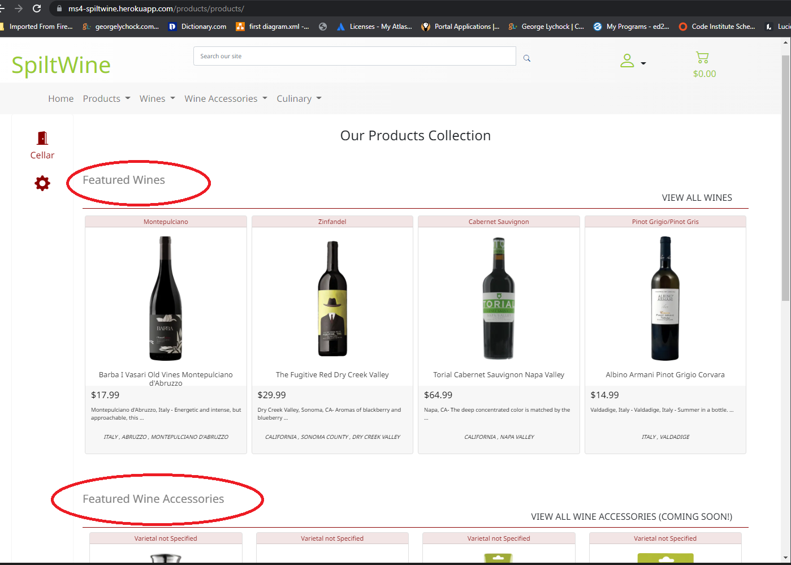

# George Lychock - MS4 Project: Unknown
### Salem State University Fullstack Software Developer Certificate
#### MS4 Django Spilt Wine
-   [View Live Dev Site]()

<h1 align="center"></h1>

## Table of Contents

-   [Usability](#TESTUSABILITY)
-   [Functionality](#TESTFUNCTIONALITY)
-   [User Stories](#TESTSTORIES)
-   [Validation](#TESTVALID)
-   [Bugs and Fixes](#BUGS)

# Testing
Followed test writing guidelines from the following resources:
    [Guru99](https://www.guru99.com/complete-web-application-testing-checklist.html), [softwaretestinghelp.com](https://www.softwaretestinghelp.com/web-application-testing/)
-   NOTE: Usability and Functionality test criteria were written based on development version but then verified once deployed to Heroku.
-   NOTE: All Validation results reported below are based on the deployed app via Heroku.

## Usability Testing
Unless otherwise noted, all the following was tested and passed:
-   Web page content should be correct without any spelling or grammatical errors
-   Tool tip text should be present upon hovering recipe name and image links and Action buttons.
-   Enough space should be provided between field labels, columns, rows, and error messages.
-   All the buttons should be in a standard format and size.
-   Check for broken links and images.
-   Confirmation message should be displayed for any kind of update and delete operation.
-   **Not Completed Perform Peer Review
-   Scroll bar should appear only if required.
-   If there is an error message on submit, the information filled by the user should remain.
-   All fields (Textbox, dropdown, radio button, etc) and buttons should be accessible by keyboard shortcuts and the user should be able to perform all operations by using keyboard.
    -   FAIL: Tab sequence and :focus styles need to be applied across the app

## Functionality Testing
Unless otherwise noted, all the following were tested and passed:
### General
-   All images and icons render correctly
-   All buttons and active links show pointer on hover
-   Mandatory fields validate correctly, display message
-   Save and Delete functions fire a confirmation and/or message
    -   Delete button displays confirmation message to user
        FAIL: no confirmation message is present

### Navigation Bar
-   #### Home
    -   Quick Search field is present
    -   Quick Search presents a dropdown of search terms
    -   Quick Search Submit button redirects user to Search page
    -   Advanced Search link is present, redirects user to Search page

-   #### Secondary Pages
    -   Home button is present for all secondary pages, redirects user to home page
    -   Page (View) Title is present
    -   Click Path arrow buttons are present on all secondary pages
        FAIL: Click path buttons currently do not correctly redirect user to previous pages/views on all pages

### Main Header and Nav
-   #### Home and Secondary Pages
    -   uSpice Logo and Byline display correctly on the left column of all pages
    -   Build recipes button redirects a logged in user to the Build Recipe page
    -   Build recipes button redirects a visiting user to the Login Page
    -   Rated Recipes button redirects all users to the Rated Recipes page

### Main Content Block
-   #### Home
    -   Top 5 rated recipes are displayed providing information on each recipe for rating, recipe name, description, and image
    -   Recipe name and image are active links that redirect all users to the Recipe Card page for the chosen recipe
    -   Tool tip is displayed when all users hover the recipe names and recipe images

-   #### Secondary Pages - Rated Recipes
    -   Top 5 rated recipes are displayed providing information on each recipe for recipe name, description, image, date posted, rating, author, and available Actions: Submit Rating
    -   Submit Rating button redirects user to the Recipe Card for the choosen recipe
    -   Recipe name is an active link that redirects all users to the Recipe Card page for the chosen recipe
    -   Tool tip is displayed when all users hover the recipe names

-   #### Secondary Pages - Register Page
    -   Displays input fields for username, email address, password, user description, and avatar choice
    -   Hover tips are displayed for all required fields
    -   Validates and displays feedback for username field, required
    -   Validates and displays feedback for email field, required
    -   Validates and displays feedback for password field, required
    -   A description text field is presented, not required
    -   An avatar pallet is display for user to choose a custom avatar from
    -   Upon Submit, user is informed of successful registration
    -   Upon Submit, user is redirected to Profile page

-   #### Secondary Pages - Login Page
    -   Displays input fields for username and password
    -   Hover tips are displayed for all required fields
    -   Validates and displays feedback for username field, required
    -   Validates and displays feedback for password field, required
    -   Upon Submit, user is informed of successful login
    -   If user cannot be authenticated, user is informed of error, presented refreshed login page
    -   Upon Submit, user is redirected to Profile page

-   #### Secondary Pages - Profile Page - Logged In User Only
    -   Displays Name of user's profile being displayed
    -   User's description is displayed
    -   User's avatar is displayed
    -   Welcome message appears when a user logs in
    -   Displays all submitted recipes for logged in user displaying information on each recipe for recipe name, description, image, date posted, rating, and available Actions: Update Rating, Delete, Edit
    -   Update Rating button redirects user to the Recipe Card for the choosen recipe
    -   Delete button displays confirmation message to user
        FAIL: no confirmation message is present
    -   Upon Confirmation, Delete button deletes the recipe form the DB and redirects user to the user Profile page
    -   Recipe name is an active link that redirects user to the Recipe Card page for the chosen recipe
    -   Tool tip is displayed when all users hover the recipe names
    -   Non-Authenticated user do not have access to profile page

-   #### Secondary Pages - My Ratings Page - Logged In User Only
    -   Displays Name of user's ratings being displayed
    -   Displays all submitted ratings for logged in user displaying information on each recipe for recipe name, date posted, rating, and available Actions: Update Rating
    -   Update Rating button redirects user to the Recipe Card for the choosen recipe
    -   Recipe name is an active link that redirects user to the Recipe Card page for the chosen recipe
    -   Tool tip is displayed when all users hover the recipe names
    -   Non-Authenticated user do not have access to Rated Recipes page

-   #### Secondary Pages - Advanced Search Page (Search Results redirect Page)
    -   Displays term used for the search
    -   Displays all recipes matching submitted query displaying information on each recipe for recipe name, description, image, date posted, rating, author, and available Actions: Update Rating
    -   Update Rating button redirects user to the Recipe Card for the choosen recipe
    -   Recipe name is an active link that redirects user to the Recipe Card page for the chosen recipe
    -   Tool tip is displayed when all users hover the recipe names

-   #### Secondary Pages - Build Recipe
    -   Displays input fields for recipe name, description, region, flavor profile, image url, image alt text, ingredient, and preparation
    -   Hover tips are displayed for all required fields
    -   Validates and displays feedback for recipe name field, required
    -   Validates and displays feedback for image url field, required
    -   Ingredients Input:
        -   Input fields are presented for Ingredient Name (dropdown), quantity (numeric input), and measure (dropdown)
        -   A button is presented to add a configured ingredient entry to the ingredients pallet
        -   If an ingredient is not fully configured with name, quantity, and measure the user is alerted of an error
            FAIL: not validation exists for the addition of the configured ingredient
        -   Once an ingredient is configured and added to the pallet, the ingredient configuration is displayed in the pallet with a remove button
        -   When the remove button is clicked, the indredient is removed
    -   Upon Submit, user is informed of successful recipe submission
    -   Upon Submit, user is redirected to saved recipe page

-   #### Secondary Pages - Edit Recipe
    -   Displays input fields for recipe name, description, region, flavor profile, image url, image alt text, ingredient, and preparation
    -   All previously saved data is displayed in the input fields
        FAIL Although all saved data is displayed, the app shows a duplicate input field for any saved Flavor options
    -   Ingredients Input:
        -   Same as Build Recipe page
    -   Upon Submit, user is informed of successful recipe update
    -   Upon Submit, user is redirected to updated recipe page

### Features Logic
-   #### Quick Search
    -   Term choosen produces a redirect to the Search Results page displaying recipes that match the quick search term
-   #### Click Path Arrows
    -   Arrows are presented in the Nav bar section on all pages other than the Home page
    -   The left and right arrows redirect user to the previous page visited based on the current click path index; left redirects down a page, right redirects up a page, if available.

## Bugs / Fixes
### Known Bugs
#### OPEN 
-   Size is a decimal for 750, 187, 375 etc
-   If the user does not enter search terms, the main search function returns user to the home page no matter where the user is on the site.
-   In the cart view, the subtotal does not compute correctly
-   Need to figure out what to do about product sizes since a different size also means a different price; probably going with a different size means a different SKU
-   The custom clearable file input function does not work; 

#### FIXED
-   Recipe Links on My Ratings:
    -   -   Links to recipes on My Ratings page do not work
        -   FIX: had to add "../" to the link to the link path

## Validation
NOTE: All Validation results reported below are based on the deployed app via Heroku.
The W3C Markup Validator and W3C CSS Validator Services were used to validate all html and css files in the project to ensure there were no syntax errors in the project.

-   [W3C Markup Validator (Nu)](https://validator.w3.org/nu/)
    -   index.html, ERRORS
        -   The duplicate error is from the duplication of code for the desktop/tablet and mobile views, no real error
            -   
    -   register.html, NO ERRORS
        -   
    -   login.html, NO ERRORS
        -   
    -   recipe.html, NO ERRORS
        -   
    -   build_recipe.html, Testing Not Complete
        -   Results TK
    -   edit_recipe.html, Testing Not Complete
        -   Results TK
    -   profile.html, Testing Not Complete
        -   Results TK
    -   rated_recipes.html, Testing Not Complete
        -   Results TK
    -   recipe_ratings.html, Testing Not Complete
        -   Results TK
    -   search.html, Testing Not Complete
        -   Results TK

-   [W3C CSS Validator (Jigsaw)](https://jigsaw.w3.org/css-validator/#validate_by_uri+with_options)
    -   style.css, NO ERRORS
    -   
-   [Lighthouse](https://developers.google.com/web/tools/lighthouse)
    -   Testing and results TK
-   [JSHint](https://jshint.com/) was used to check Javascript function logic and syntax. The following were errors captured during testing that have not been addressed:
    -   script.js functions
        -   Common Functions: confirmDeleteRecipe(), ratingConfirm(), getLocalStorageArray(lsName), clearLocalStorage(lsName)
            -   
        -   Ingredient Functions: addIngredient(), removeIngredient(iID), buildIngredientForm(i)
            -   
        -   Click Path Arrow Functions: storeClickPath(path), updateCurrentIndex(direction), buildBannerButton(direction)
            -   
-   All Python functions were verified for PEP8 compliance at [pep8online.com](http://pep8online.com/)

## User Story Testing
Testing User Stories from User Experience (UX) Section

-   #### **Story 1** As a Site Visitor, I want to be able to search recipes by using a quick search method.
    -  #### *Acceptance Criteria*
        1.  A search form is presented without leaving the home page
        2.  A minimal number of search criteria is presented to choose from
        3.  When the form is submitted, user is redirected to the advanced search page and presented the results list/table
        -   Results
            -   PASS: All criteria met
                -   Screeshots:
                    -   
                    -   

-   #### **Story 2** As a Site Visitor, I want to see results of my search on a new page that offers sortable headers.
    -  #### *Acceptance Criteria*
        1.  Results are displayed in a list/table, with recipe title, date posted, base ingredient, and author
        2.  The list can be sorted by active headers
        3.  A recipe has a clickable link to display the recipe details
        -   Results
            -   FAIL: Criteria not met, search results page does not offer a method to sort by headers. User story was created prior to developer's understanding of what would be achievable with curriculum taught

-   #### **Story 3** As a Site Visitor, I want to see recipe details displayed on a recipe detail page
    -  #### *Acceptance Criteria*
        -   Recipe page includes the following details:
            1.  Recipe Name
            2.  Author
            3.  Ingredients
            4.  Description
            5.  Instructions (commentary)
            6.  Image
            7.  Posted Date
            -   Results
                -   PASS: All criteria met
                    -   Screeshot:
                        -   

-   #### **Story 4** As a Site Visitor, I want to have a similar experience whether on a desktop, tablet, or mobile device, so that I can later access information in a similar manner if I change devices.
    -  #### *Acceptance Criteria*
        1.  All content has to be accessible from desktop, tablet, or mobile device.
        2.  All images should have alt text
        3.  Icons should be consistent across viewports
        4.  Indentation (margins and padding) should be structurally similar across viewports
        5.  Pages and sections use the same names throughout the site ie when referring to Work History, it's not later referred to Work Experience or Job Summary etc somewhere else in the site or on site nav
        6.  All fonts are consistent for each section and element across all viewports
        7.  All documents and links to external sites should open a new tab in the browser
        8.  Any page or internal site links should never open a new browser tab
        -   Results
            -   PASS, with exception: All criteria met but tablet viewport needs minor MU adjustment and some media targeted styles to be more inline to mobile and desktop views

-   #### **Story 5** As a Site Visitor, I want to be able to search recipes by using an advanced search method.
    -  #### *Acceptance Criteria*
        1.  A search form is presented on a new page when a user navigates to the advanced search
        2.  The search form allows input for recipe name, author, main ingredient, and date
        3. The submit button displays a results list/table on the advanced search page
        -   Results
            -   FAIL: Criteria not met, advanced search page does not offer a method to search recipes by multiple criteria. User story was created prior to developer's understanding of what would be achievable with curriculum taught

-   #### **Story 6** As a Site Visitor, I want the ability to log in and log out so I can gain access to features that are only for logged in users.
-   #### *Acceptance Criteria*
    1.  User can create a profile and log in
    2.  The profile is a user name, a valid email address, a description, and an avatar
    3.  Once logged in, access to rate and build recipes is provided
    4.  User can log out
    5.  Once logged in, user is redirected to profile page
    -   Results
        -   PASS: All criteria met
            -   Screeshot:
                -   

-   #### **Story 7** As a Logged In User, I want the ability to create my own recipe and upload to the app.
-   #### *Acceptance Criteria*
    -   User Input should include the following:
        1.  Recipe Name
        2.  Author
        3.  Ingredients
        4.  Region
        5.  Preparation (commentary)
        6.  Flavor Profile
        7.  Recipe Image URL
        8.  Description
    -   User can save recipe
    -   User is routed to the recipe view page once submitted
    -   User can update the recipe
    -   User can delete the recipe
    -   Unauthenticated users cannot create and upload recipes
        -   Results
            -   PASS: All criteria met
                -   Screeshots:
                    -   
                    -   

-   #### **Story 8** As a Logged In User and on the Recipe View page, I want the ability to view a graphcal representation of my recipe ingredient breakdown.
-   #### *Acceptance Criteria*
    -   User is shown or presented a method to show a graphic depicting the recipe's ingredient ratios
        -   Results
            -   FAIL: Ingredient proportion calculations and display feature was not developed for this release.

-   #### **Story 9** As a Logged In User I want to be able to rate recipes.
-   #### *Acceptance Criteria*
    1.  User can rate a recipe with a simple 5 star system when logged in and on the recipe card page
    2.  A user cannot rate a recipe if they are not logged in
        -   Results
            -   PASS: All criteria met
                    -   Screeshots:
                        -   

-   ### Administrator User Experience
    -   #### **Story 10** As a Site Administrator, I want to be able to regulate the number of postings for any user globally
        -  #### *Acceptance Criteria*
            1.  App only allows any user to upload 5 recipes a day
            -   Results
                -   FAIL: This security feature was not developed for this release.