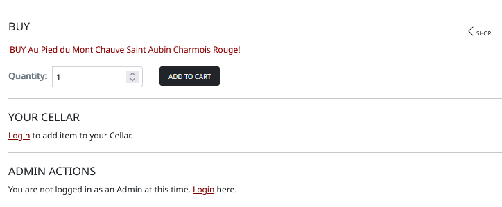

# George Lychock - MS4 Project: Unknown
### Salem State University Fullstack Software Developer Certificate
#### MS4 Django Spilt Wine
-   [View Live Dev Site](https://ms4-spiltwine.herokuapp.com/)

<h1 align="center"></h1>

## Table of Contents

-   [Usability](#TESTUSABILITY)
-   [Functionality](#TESTFUNCTIONALITY)
-   [Bugs and Fixes](#BUGS)
-   [Validation](#TESTVALID)
-   [User Stories](#TESTSTORIES)

# Testing
Followed test writing guidelines from the following resources:
    [Guru99](https://www.guru99.com/complete-web-application-testing-checklist.html), [softwaretestinghelp.com](https://www.softwaretestinghelp.com/web-application-testing/)
-   NOTE: Usability and Functionality test criteria were written based on development version but then verified once deployed to Heroku.
-   NOTE: All Validation results reported below are based on the deployed app via Heroku.

## Usability Testing
Unless otherwise noted, all the following was tested and passed:
-   Web page content should be correct without any spelling or grammatical errors
-   Enough space should be provided between field labels, columns, rows, and error messages.
-   All the buttons should be in a standard format and size.
-   Check for broken links and images.
-   Confirmation message should be displayed for any kind of update and delete operation.
-   **Not Completed: Perform Peer Review
-   Scroll bar should appear only if required.
-   If there is an error message on submit, the information filled by the user should remain.
-   All fields (Textbox, dropdown, radio button, etc) and buttons should be accessible by keyboard shortcuts and the user should be able to perform all operations by using keyboard.   

## Functionality Testing

Unless otherwise noted, all the following were tested and passed:

### General
-   All images and icons render correctly
-   All buttons and active links show pointer on hover
    -   FAIL: The Settings icon has no action applied
-   Mandatory fields validate correctly, display message
    -   FAIL: Several fields on the Add Product view do not display an error message if not input correctly, although the form does validate correctly and there is a visual indication what fields are required (with an *)
-   Save, Add, Update, and Delete functions fire a confirmation and/or message

### Navigation Bar, Menu Items, User Links
-   #### Home
    -   A site Search field is present on all page views.
    -   The Search submit button redirects user to Search results page displaying a listing of valid search items
    -   A user profile icon is present displaying links to register, login, and if logged as an admin, the Add Product link
    -   A cart link is displayed; the cart icon is an outline if there are no items in the cart, the icon changes color to green and is filled if items are present in the cart
    -   A nav bar is present offering dropdown links to Products, Wines, Wine Accessories, and Culinary product pages
        -   INCOMPLETE: Wine Accessories and Culinary links are placeholders and rediect back to the main Products page
    -   The Wines dropdown presents links to Varietals, By Country/State, By Price, and All Wines pages
        -   Links correctly redirect user to pages displaying products sorted as indicated
    -   A Cellar link is present to the user
        -   The Cellar link redirects a logged in user to their personal Cellar; if not logged in, redirects to the Sign In page.
    -   A Setting icon is presented to the user
        -   INCOMPLETE: The Setting icon performs no action at this time
    -   The Main content area presents the user with links to view all products, view all wines, and the Cellar
    -   A link to Learn More is present and opens a modal giving the user information as to what the Cellar is and how to use it.

-   #### Secondary Pages
    -   User Profile, cart, Cellar, and all nav bar links are present on all secondary pages
    -   Main logo is alway present and redirects user back to the Home page whem selected

### Main Content Blocks
-   #### Home
    -   All Home page content displays clearly on all viewports
        -   On mobile viewports the background image is floated left to create a better user ecperience for access to the links and for title/subtitle readability

-   #### Add Wine Product
    -   Select Fields display first choice instead of "select..."
        -   FAIL: Several fields display the first option in select fields instead of "select..."
    -   Displays all input fields according to user story
    -   Required fields are indicated with an "*"
    -   Upon Submit, user is informed of successful product submission
    -   Upon Submit, user is redirected to the new product's detail page
    -   Non-Authenticated users and users without correct permissions do not have access to Add Wine Product page
    
-   #### Secondary Pages - All Wines
    -   A wine product count is displayed in the main content header displaying the number of wines on display
    -   A Sort By dropdown is presented allowing the user to sort the current listing by Price (low and high), Name (A to Z and Z to A), Country (A to X and Z to A), and Varietal  (A to X and Z to A)
        -   FAIL: Sort By Varietal works in Dev but not when deployed to Heroku
    -   Product image and product name on the product cards are hot-linked to the product's detail page
    -   A Featured Wines sidebar is present displaying all wines marked as Featured in the database

-   #### Secondary Pages - Authentication, Register
    -   Displays input fields for username, email address, and password
    -   Validates for username field, required
    -   Validates for email field, required
    -   Validates for password and password confirm fields, required
    -   Upon Submit, user is informed of successful registration
    -   Upon Submit, user is redirected to an email confirmation page informing theuser to verify their email address from their email Inbox
    -   Email is correctly sent to user and the verify email link correctly sets the email to 'verified' in the database

-   #### Secondary Pages - Authentication, Login
    -   Displays input fields for username and password
    -   Validates for username field, required
    -   Validates for password field, required
    -   Upon Submit, user is informed of successful login
    -   If user cannot be authenticated, user is informed of error, presented refreshed login page
    -   Upon Submit, and successful authentication, user is redirected to Profile page

-   #### Secondary Pages - Profile Page - Logged In User Only
    -   Displays Name of user's profile being displayed
    -   All user information defined in the user story is present
    -   Welcome message appears when a user logs in
    -   Displays all user orders in an Order History section
    -   Non-Authenticated users do not have access to profile page

-   #### Secondary Pages - Search Results Page (Products page with search summary at top)
    -   Displays term used for the search
    -   Displays all wines matching submitted query displaying name, varietal, region, price
    -   Wine name is hotlinked to the wine detail page

-   #### Secondary Pages - Cart
    -   If Cart is empty a message is displayed and a link is provided to keep shopping
    -   All items added to the Cart are present, for anonymous and authenticated in users
    -   Image, Name, size, SKU, Price. Quantity, and Subtotl are presented for each item
    -   And edit and a remove link are present.
    -   Edit link updates the quantity of the item in the cart abd adjusts totals
    -   Remove link removes the item from the cart and adjusts totals
    -   Correct Cart total is displayed
    -   Shipping charges, if applicable, are displayed
    -   A message is displayed if the free shipping threshold is not yet met
    -   Grand Total is correct
    -   Keep Shopping link is presented and redirects user to the All Wines view
    -   A link to complete the purchase via a secure method is presented

-   #### Secondary Pages - Cart, Checkout
    -   The Check Out page is presented with all required Stripe fields
    -   A message indicating the amount about to be charged is presented
    -   A link back to the Cart is presented
    -   An Order Summary is presented
        -   INCOMPLETE: Styles for the checkout view and Order Summary are not completed

-   #### Secondary Pages - Wine Details
    -   Full details on the wine product are presented to the user
    -   Indication that the wine product is a fetaured wine is present
    -   Option to add the product to the cart is presented, with quantity input
    -   Add to Cellar option is presented to authenticated users; a login option is presented to anonymous users
    -   Option to access admin actions is presented
    -   Admin actions are presented to authenticated users; a login option is presented to anonymous users

-   #### Secondary Pages - Wine Details, Add to Cellar
    -   Displays a product card and presents user with an option to adjust the quantity of the product to be added to the Cellar
    -   Submit button updates the Cellar, confirms update was successful, and redirects user to their Cellar

-   #### Secondary Pages - Wine Details, Edit/Delete
    -   Edit option redirects user to the product update form
    -   Delete option presents user with a confirmation box

-   #### Secondary Pages - Cellar
    -   Displays a listing of wines added by the user
    -   Displays all wine product info according to user story
    -   Displays a link to return to the All Wines view
    -   Displays a link to present more information about the Cellar
    -   Displays a statistics panel on desktop and tablet viewports
    -   Displays a method to view statistic on mobile viewports

-   #### Secondary Pages - Cellar, Update/Remove
    -   Provides user with a method to update the quantity of a cellar item
    -   Update action correctly updates the database and displays the updated list
    -   Remove link correctly removes item from the user cellar
    -   Setting the quantity of a Cellar item to zero does not remove it from the Cellar list

-   #### Secondary Pages - Varietals
    -   Displays a listing of wine grape varietals along with a description (only displayed in desktop and tablet viewports due to space constraints on mobile)
    -   Provides links to informational resources for each varietal
    -   Provides a link to shop wines that are made from the varietal

### Messaging
-   #### Home and Secondary Pages
    -   If a user is logged in, a username greeting should appear if no other messages are present
    -   A valid, helpful message is displayed to confirm all submit actions across the site
    -   Messages clear once another action is taken or a redirect is performed

## Bugs / Fixes
### Known Bugs
#### OPEN 
-   There is no confirmation request on any delete/remove actions.
-   Size is a decimal for 750, 187, 375 etc
-   If the user does not enter search terms, the main search function returns user to the home page no matter where the user is on the site.
-   In the cart view, the subtotal does not compute correctly
-   Need to figure out what to do about product sizes since a different size also means a different price; probably going with a different size means a different SKU
-   The custom clearable file input function does not work; 
-   Do not get the email context in the CLI when order is successfully completed.
        CI video shows POST to checkout/wh, dev shows just checkout/
-   Varietal sorting in the sorting dropdowns on category views is working in DEV but not on deployed app in Heroku
-   Gray background on the product card footer does not extend to the bottom of the card on mobile viewport

#### FIXED
-   webp file format does not work on browsers on iPhone6 and lower running iOS 12; all product images are currently in webp format, alt format would need to be created
    -   FIXED: Converted all images to png format and reloaded to AWS, changed all urls in both Dev and Heroku DBs
-   Redirect errors with use of reverse and args:
    -   The following code is the instruction does not work in the current Django:
            return redirect(reverse('checkout_success', args=[order.order_number]))
    -   replaced with:
            return redirect('checkout_success', order_number=order.order_number)

## Validation
NOTE: All Validation results reported below are based on the deployed app via Heroku.
The W3C Markup Validator and W3C CSS Validator Services were used to validate all html and css files in the project to ensure there were no syntax errors in the project.

-   [W3C Markup Validator (Nu)](https://validator.w3.org/nu/)
    -   index.html, ERRORS
        -   The duplicate ID errors are from the duplication of code for the desktop/tablet and mobile views, no real error
        -   Ignoring the header error for the article element. More work needs to be done on proper semantics for this site
    -   products.html, ERRORS
        -   Same errors as reported on index.html
    -   wines.html, ERRORS
        -   Removed script type designation in js links
        -   Otherwise, same errors as reported on index.html
    -   varietals.html, ERRORS
        -   Same errors as reported on index.html
    -   profiles.html, ERRORS
        -   Same errors as reported on index.html
    -   cart.html, ERRORS
        -   Removed script type designation in js links
        -   Otherwise, same errors as reported on index.html
    -   cellar.html, ERRORS
        -   Same errors as reported on index.html

-   [W3C CSS Validator (Jigsaw)](https://jigsaw.w3.org/css-validator/#validate_by_uri+with_options)
    -   style.css, NO ERRORS
-   [Lighthouse](https://developers.google.com/web/tools/lighthouse)
    -   Testing and results TK
-   [JSHint](https://jshint.com/) was used to check Javascript function logic and syntax.
    -   All js files passed.
-   All Python functions were verified for PEP8 compliance at [pep8online.com](http://pep8online.com/)
    -   Base Project App
        -   urls.py: PASS
    -   Cart
        -   views.py: FAIL, lines 28, 32 exceed char line limit
        -   urls.py: PASS
        -   contexts.py: PASS
    -   Cellar
        -   views.py: FAIL, lines 80, 105 exceed char line limit
        -   urls.py: PASS
        -   models.py: PASS
        -   contexts.py: PASS
    -   Home
        -   views.py: PASS
    -   Products
        -   views.py: FAIL, lines 40, 190, 219 exceed char line limit
        -   urls.py: PASS
        -   models.py: PASS
        -   forms.py: FAIL, line 6 exceeds char line limit
        -   contexts.py: PASS
    -   Profiles
        -   views.py: PASS
        -   urls.py: PASS
        -   models.py: PASS
        -   forms.py: FAIL, line 43 exceeds char line limit
        -   contexts.py: PASS

## User Story Testing

-   ### Visitor/Shopper
    -   #### **Story V-1** As a Visitor/Shopper I want to be able to view a list of products so that I can select a product to purchase.
        -  #### *Acceptance Criteria*
            1.  A list of product categories is presented
                -   PASS: All criteria met.
                    -   The View Our Products link on the home page presents products listed by product category:
                    -   
            2.  Category links present user with category product listings
                -   BUG: Only the Wine category links work. Please see opening notes on README.md
                    -   The Wine links present user with products sorted by the wine category:
                    -   
            3.  Product listings and featured sidebars should display as product cards displaying: product name, varietal (for wines), product image, price, a truncated description, origin of wine (for wines)
                -   PASS: All criteria met.
                    -   Products are presented with correct information:
                    -   
            4.  Product image and name should link to product detail page (described below)
                -   PASS: All criteria met. The product titles and images link to a product detail page.

    -   #### **Story V-2** As a Visitor/Shopper I want to be able to view individual product details so that I can determine a product description, image, and product info.
        -  #### *Acceptance Criteria*
            1.  Product details view should be accessible from all product listings, featured sidebars, product summaries (eg in the Cart or Cellar summaries), and search results summaries
                -   PASS: All criteria met. See Functionality Testing.
            2.  The wine detail view should present all of the following information: product name, varietal, product image, price, a full description, origin of wine, size, units for size, wine type, body, ABV, style
                -   PASS: All criteria met.
                    -   Products are presented with correct information:
                    -   
            3.  Present an Add to Cart option, for all users
                -   PASS: All criteria met. An Add to Cart option is presented to all users.
            4.  Present an Add to Cellar option, for authenticated users. If user is not authenticated a login option is displayed.
                -   PASS: All criteria met.
                    -   Add to Cellar is only presented to authenticated users; Login option is displayed otherwise.
                    -   Unauthenticated User:
                    -   
                    -   Authenticated User:
                    -   
            5.  Present an Edit and Delete option, for admin authenticated users
                -   PASS: All criteria met.
                    -   Edit/Delete options are presented only to admin (super) users; Login option is displayed otherwise.
                    -   

    -   #### **Story V-3** As a Visitor/Shopper I want to be able to view any featured items so that I can view product(s) the company feels are of particular interest of me.
        -  #### *Acceptance Criteria*
            1.  A Featured Items panel/section is presented on any product category view
                -   PASS: All criteria met. A featured items minor column is presented on the All Wines and subcategory views.
            2.  Featured items should present a product's name, image, varietal (for wine products), price, and origin (for wine products)
                -   PASS: All criteria met.
                    -   All information is present:
                    -   
            3.  The featured product image and title should be linked to the product's detail page
                -   PASS: All criteria met. Both links redirect correctly.

    -   #### **Story S-1** As a Visitor/Shopper I want to be able to sort a list of products by price, name, country/state, or varietal so that I can view products more similar to what I'm looking for.
        -  #### *Acceptance Criteria*
            1.  A dropdown is presented in the main menu for the user to sort products by name (all products in alpha order), price, country/state, and varietal (for wine products)
                -   PASS: All criteria met.
                    -   Sort options are present in the main nav dropdowns:
                    -   
            2.  A dropdown is presented in the product category listings for the user to sort products by name (all products in alpha order), price, country/state, and varietal (for wine products)
                -   FAIL/BUG: Sort options are present in the sort dropdown; all sort options work correctly except for varietal. Varietal sorting is working in DEV but not on deployed app in Heroku.
                    -   Sort options are present in the sort dropdown:
                    -   

-   ### Authenticated User
    -   #### **Story C-1** As a/an Logged In User I want to be able to add, update, or delete wines from a personal library so that I can see a listing of all the wine I have in my wine collection.
        -  #### *Acceptance Criteria*
            1.  An Add to Cellar option is presented to authenticated users on the wine details view and redirects user to the add to cellar view, or, if the item is already in the cellar redirects to the update cellar view
                -   PASS: All criteria met.
            2.  The option adds/updates the wine to the user's cellar, confirms an item has been added/updated, then redirects to the user's cellar
                -   PASS: All criteria met.
                    -   Items are correctly add/updated in the cellar, messages indicate whether the user added or updated the cellar item:
                    -   
            3.  A Cellar icon is presented to all users in a menu panel on all main views which directs the user to their cellar view
                -   PASS: All criteria met.
            4.  Clicking Cellar icon: Authenticated users are directed to their personal cellar view
                -   PASS: All criteria met.
            5.  Clicking Cellar icon: Unauthenticated users are directed to the login page
                -   PASS: All criteria met.
            6.  The Cellar view displays a message if the cellar is empty
                -   PASS: All criteria met.
                    -   Empty cellar message:
                    -   
            7.  A list of saved cellar items is presented if items have been added to the user's cellar. The list displays the product image, name, vintage, SKU, price, quantity on-hand in cellar, and subtotal value of each cellar item
                -   PASS: All criteria met.
                    -   Cellar view with cellar items listed and update and remove item links are present:
                    -   
            8.  The quantity on-hand field displays the current quantity of the item in the user's cellar and is editable; quantity can be updated
                -   PASS: All criteria met.
            9.  Update is confirmed
                -   PASS: All criteria met. User is presented with an update confirmation.
            10. The item can be removed from the Cellar
                -   PASS: All criteria met. User is presented with a removal confirmation.

    -   #### **Story C-2** As a/an Logged In User I want to be able to view metrics of my wine library so that I can understand the make up of my wine collection.
        -  #### *Acceptance Criteria*
            1.  A cellar statistics panel is displayed to the user displaying the following information based on the wines in the user's cellar:
                >- Cellar Value
                >- Number of items in the cellar
                >- Number of varietals in the cellar
                >- A list of the different varietals represented in the cellar
                -   PASS: All criteria met.
                    -   The Cellar Statics panel is presented to the user with all infomation contained:
                    -   

-   ### Administrator
    -   #### **Story A-1** As an Administrator I want to be able to add and delete wine products in the wine product database so that I can provide access to their information throughout the website.
        -  #### *Acceptance Criteria*
            1.  A link to a wine product management option should be presented on the user menu dropdown for all users with editing rights or admin privileges.
                -   PASS: All criteria met. The product management link is only present for admin
            2.  The option should present the user with a method to add a new product
                -   PASS: All criteria met. A product Add view is presented
            3.  The method should present a form that allows the user to input all required and optional data for the product
                -   Included fields for wine products (*required fields): *product name, vintage, brand, SKU, featured option, product image, product image url, has sizes option, *size, measure, price, *a full description, *country or state origin, region origin, appellation origin, *wine type, *varietal, *body, *style, ABV, taste field
                -   PASS: All criteria met.
                    -   The Product Add presents all of the correct fields
            4.  Upon clicking, an Add Product submit button should inform the user the product data has been saved and redirect the user to the new product's detail view
                -   PASS: All criteria met. User is redirected correctly with correct message
            5.  Product information is added correctly
                -   PASS: All criteria met. New product is added to the database correctly and displays all information submitted on the Add Product form
            6.  A link to delete a wine product should be presented on the wine product details view for all users with editing rights or admin privileges
                -   PASS: All criteria met. A product Delete link is presented only to admin on the product details view
            7.  A confirmation method should be presented to the admin to confirm product deletion
                -   PASS: Confirmation presented
            8.  User is returned to the product category view when user confirms deletion
                -   PASS: All criteria met.
            9.  Message is displayed indicating the product was deleted successfully
                -   FAIL: No message is displayed after confirmation submit.

    -   #### **Story A-2** As an Administrator I want to be able to update wine products in the wine product database so that I can provide access to their information throughout the website.
        -  #### *Acceptance Criteria*
            1.  A link to a Product Update view should be presented on the wine product details view for all users with editing rights or admin privileges.
                -   PASS: All criteria met. A product Edit link is presented only to admin on the product details view
            2.  Once at Product Update, a message indicating what product is being edited should be present
                -   PASS: All criteria met. Editing message is displayed
                -   
            3.  The Product Update view should contain all the following fields (read only fields are indicated, otherwise all fields can be edited): product name, vintage, brand, SKU, featured option, product image, product image url, has sizes option, size, measure, price, a full description, country or state origin, region origin, appellation origin, wine type, varietal, body, style, ABV, taste field
                -   PASS: All criteria met.
                    -   The Product Update presents all of the fields correctly
            4.  Product information is updated correctly when I submit changes
                -   PASS: All criteria met.
            5.  User is returned to the product detail page when changes are submitted
                -   PASS: All criteria met.
            6.  Message is displayed indicating save was completed successfully
                -   PASS: All criteria met.